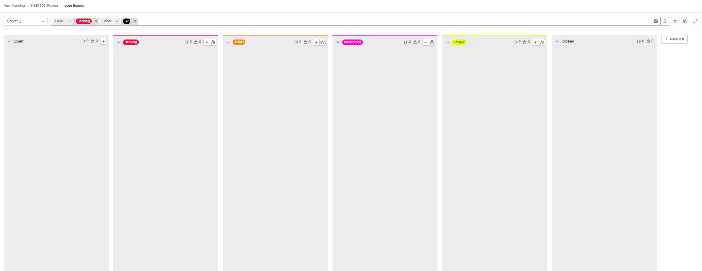

# Development Lifecycle

1. **Create a merge request off the issue.**
2. **Develop on that branch (trunk-based branching strategy).**
3. **Develop only within the issue scope.**
    1. If the issue scope expands, do not keep coding. Split it up into other issues if the scope exceeds the estimated time (use your judgment).
4. **All code should be unit tested; this responsibility is primarily on the developer.**
5. **All code should be documented, with types defined in the documentation as shown below.**
6. **Code reviewed by 2 reviewers.**
7. **Once 2 approvals are given and the code passes all unit tests, the developer can then merge the branch.**

```javascript
/**
* This code does some stuff.
* @param {Number} param1 - Explanation of what param1 is.
* @param {"fixed" | "something" | "another option"} param2 - Explanation of what param2 is.
* @returns {void}
**/
const testMethod = (param1, param2) => {
    // ...(code)...
}
```

# Kanban Board Format

Each sprint will follow the same format with 6 columns, and each sprint will be filtered based on two conditions: backlog and S(x), where x is the current sprint. The main reason for this is to reduce pollution from other sprints, ensuring that tickets from earlier sprints are not present within the current sprint. The only work on the board is the current work for the sprint plus any missed work which must be completed.

- **Open**: Tickets to research.
- **Backlog**: Backlog tickets that need to be completed and are results of uncompleted work from previous sprints (priority).
- **TODO**: Tickets that are planned and have technical specs laid out, ready to be picked up by a developer.
- **Developing**: Tickets currently being developed by someone.
- **Review**: Tickets that have passed all unit tests and are awaiting review from 2 reviewers.
- **Closed**: Merged tickets.

An example of this format can be seen here: 

# Work Lifecycle

We will work in jogs and sprints. The purpose of a jog is to plan, scope, and define tickets (and casual developing), with the goal of having all tickets and backlog items planned and ready for the following sprint.

In a sprint, the main starting goal is to have a good outline of all the work that needs to be done. This means all tickets should be ready and tagged within the open column on the kanban board, along with backlog tickets that need to be picked up. Throughout the sprint, developers will work on tickets according to the development lifecycle defined above, moving and tagging the tickets into their appropriate columns. The main goal is to have a clear backlog column and all tickets tagged with S(x) merged into the main branch.

**Timings of jogs and sprints:** To be decided.

**Sprint Planning Meeting:** At the end of a jog, a meeting should be held with the group to discuss which issues will be developed by whom. A strategy should be evaluated and planned for each sprint, allowing everyone to contribute and discuss.
